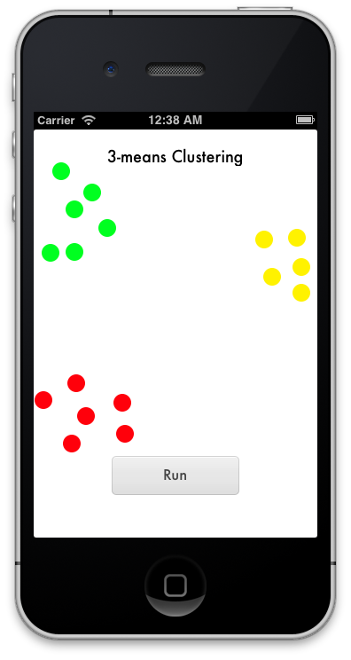
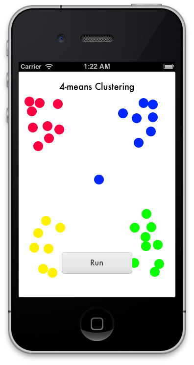

# Overview
A very basic [k-means clustering](http://en.wikipedia.org/wiki/K-means_clustering) implementation in Objective-C.
Includes an example app to test it out.

## Examples

## Implementation
Create an object to cluster (e.g. a point) that inherits from `GWClusterObject` and implements `- (double)calculatePenaltyAgainstObject:(GWClusterObject *)object`.
Then instantiate a `GWCluster` with a list of objects, an initial length-k list of means, and a block to calculate the mean of a group of objects.
